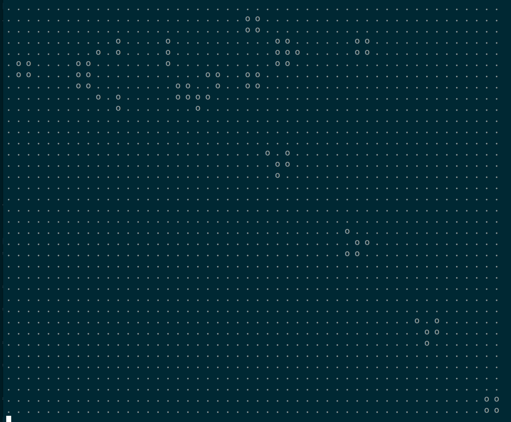

Conway's Game of Life
==

The entry point to your code should be a class called `GameOfLife`, which must
have a `run` method, and take the following string in the constructor (see
bin/gol):

```
. . . . . . . . . . . . . . . . . . . . . . . . . . . . . . . . . . . . . . . . . . . . . . . . . .
. . . . . . . . . . . . . . . . . . . . . . . . . o . . . . . . . . . . . . . . . . . . . . . . . .
. . . . . . . . . . . . . . . . . . . . . . . o . o . . . . . . . . . . . . . . . . . . . . . . . .
. . . . . . . . . . . . . o o . . . . . . o o . . . . . . . . . . . . o o . . . . . . . . . . . . .
. . . . . . . . . . . . o . . . o . . . . o o . . . . . . . . . . . . o o . . . . . . . . . . . . .
. o o . . . . . . . . o . . . . . o . . . o o . . . . . . . . . . . . . . . . . . . . . . . . . . .
. o o . . . . . . . . o . . . o . o o . . . . o . o . . . . . . . . . . . . . . . . . . . . . . . .
. . . . . . . . . . . o . . . . . o . . . . . . . o . . . . . . . . . . . . . . . . . . . . . . . .
. . . . . . . . . . . . o . . . o . . . . . . . . . . . . . . . . . . . . . . . . . . . . . . . . .
. . . . . . . . . . . . . o o . . . . . . . . . . . . . . . . . . . . . . . . . . . . . . . . . . .
. . . . . . . . . . . . . . . . . . . . . . . . . . . . . . . . . . . . . . . . . . . . . . . . . .
. . . . . . . . . . . . . . . . . . . . . . . . . . . . . . . . . . . . . . . . . . . . . . . . . .
. . . . . . . . . . . . . . . . . . . . . . . . . . . . . . . . . . . . . . . . . . . . . . . . . .
. . . . . . . . . . . . . . . . . . . . . . . . . . . . . . . . . . . . . . . . . . . . . . . . . .
. . . . . . . . . . . . . . . . . . . . . . . . . . . . . . . . . . . . . . . . . . . . . . . . . .
. . . . . . . . . . . . . . . . . . . . . . . . . . . . . . . . . . . . . . . . . . . . . . . . . .
. . . . . . . . . . . . . . . . . . . . . . . . . . . . . . . . . . . . . . . . . . . . . . . . . .
. . . . . . . . . . . . . . . . . . . . . . . . . . . . . . . . . . . . . . . . . . . . . . . . . .
. . . . . . . . . . . . . . . . . . . . . . . . . . . . . . . . . . . . . . . . . . . . . . . . . .
. . . . . . . . . . . . . . . . . . . . . . . . . . . . . . . . . . . . . . . . . . . . . . . . . .
. . . . . . . . . . . . . . . . . . . . . . . . . . . . . . . . . . . . . . . . . . . . . . . . . .
. . . . . . . . . . . . . . . . . . . . . . . . . . . . . . . . . . . . . . . . . . . . . . . . . .
. . . . . . . . . . . . . . . . . . . . . . . . . . . . . . . . . . . . . . . . . . . . . . . . . .
. . . . . . . . . . . . . . . . . . . . . . . . . . . . . . . . . . . . . . . . . . . . . . . . . .
. . . . . . . . . . . . . . . . . . . . . . . . . . . . . . . . . . . . . . . . . . . . . . . . . .
. . . . . . . . . . . . . . . . . . . . . . . . . . . . . . . . . . . . . . . . . . . . . . . . . .
. . . . . . . . . . . . . . . . . . . . . . . . . . . . . . . . . . . . . . . . . . . . . . . . . .
. . . . . . . . . . . . . . . . . . . . . . . . . . . . . . . . . . . . . . . . . . . . . . . . . .
. . . . . . . . . . . . . . . . . . . . . . . . . . . . . . . . . . . . . . . . . . . . . . . . . .
. . . . . . . . . . . . . . . . . . . . . . . . . . . . . . . . . . . . . . . . . . . . . . . . . .
. . . . . . . . . . . . . . . . . . . . . . . . . . . . . . . . . . . . . . . . . . . . . . . . . .
. . . . . . . . . . . . . . . . . . . . . . . . . . . . . . . . . . . . . . . . . . . . . . . . . .
. . . . . . . . . . . . . . . . . . . . . . . . . . . . . . . . . . . . . . . . . . . . . . . . . .
. . . . . . . . . . . . . . . . . . . . . . . . . . . . . . . . . . . . . . . . . . . . . . . . . .
. . . . . . . . . . . . . . . . . . . . . . . . . . . . . . . . . . . . . . . . . . . . . . . . . .
. . . . . . . . . . . . . . . . . . . . . . . . . . . . . . . . . . . . . . . . . . . . . . . . . .
. . . . . . . . . . . . . . . . . . . . . . . . . . . . . . . . . . . . . . . . . . . . . . . . . .
```

This represents the game board. Each o represents a live cell, and each .
represents a dead cell. The spaces are for alignment. Each "turn" or "tick", the
following rules should be applied to each cell:

- If the cell is alive and it has 2 or 3 neighbors, it lives.
- If the cell is alive and it has less than 2 neighbors, it dies due to
  underpopulation.
- If the cell is alive and it has more than 3 neighbors, it dies due to
  overpopulation
- If the cell is dead and it has *exactly* 3 neighbors, it becomes alive due to
  reproduction
- If the cell is dead and it has any number of neighbors other than 3, it
  remains dead.

The board should be spit out into the terminal, with the same character
representation as the string above. (Note: `puts "\e[H\e[2J"` will clear the
terminal). You can test your code by running `bin/gol` in the terminal. If done
correctly, you should see groups of live cells move slowly down and to the right
from the top center, like so:



You may write tests if you find it helpful, but it is not required. My solution lives in
the `solutions` branch, to compare solutions when finished. Good luck.

